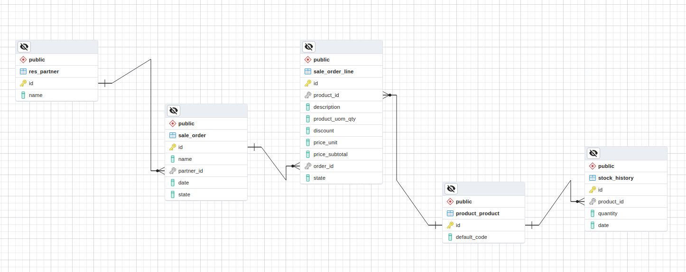

# Prueba técnica

Para elaborar y comporbar el código que diera solución a la prueba, he decidido utilizar jupyter notebooks. Hacerlo en un archivo .py hubiera sido quizá más eficiente, pero los jupyter me permiten comentar bien el proceso y mostrar resultados intermedios.

Este repositorio está estructurado de la siguiente manera:

+ En la carpeta jupyter_notebooks hay dos archivos: uno con el proceso de creación de datos falsos para comprobar el código y otro con la solución en sí.
+ En la carpeta test_data están guardados los datos en csv, aunque el código está preparado para aplicarlo a una base de datos de postgresql directamente a través de una query o importando los datos como dataframes.
+ Por último, en la carpeta de imágenes está el ERD de la base de datos que replica el del enunciado -el mismo que hay en el readme- y que he construido y llenado también en una base de datos local para comprobar que la query funcionaba.

Gracias por vuestro tiempo!
